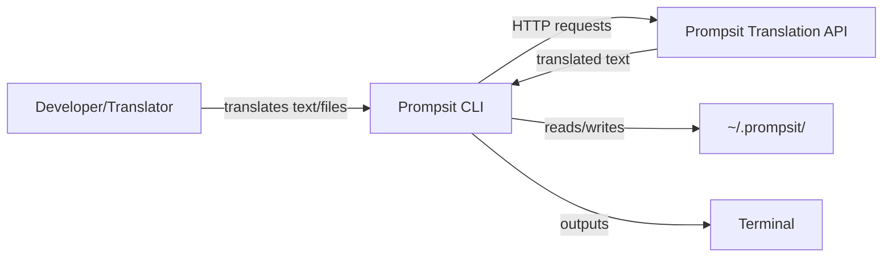
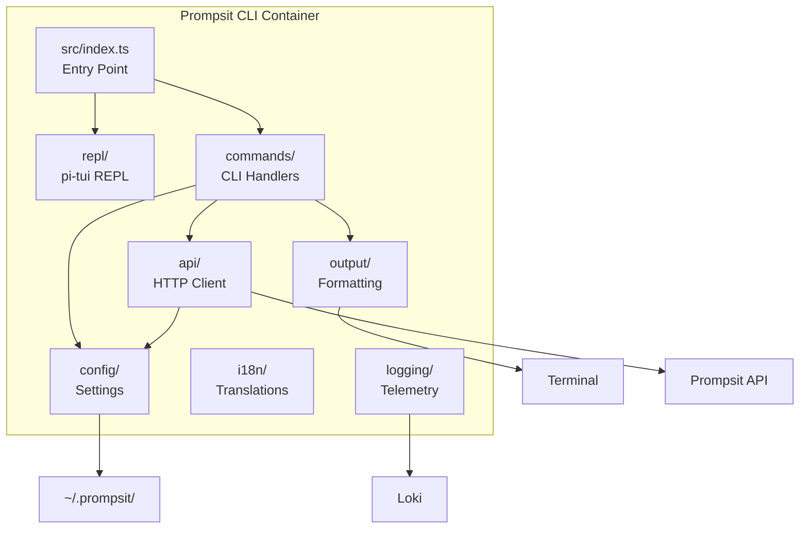
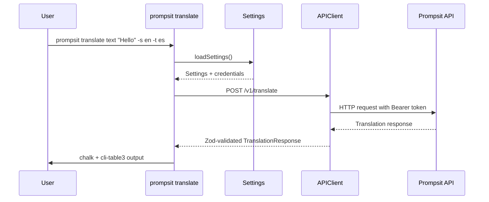
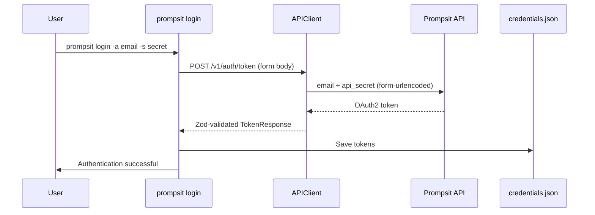

# Architecture Document: Prompsit CLI

**Document Version:** 2.0
**Date:** 2026-03-01
**Standard Compliance:** ISO/IEC/IEEE 42010:2022, arc42 Template

<!-- SCOPE: arc42 architecture documentation with C4 Model diagrams, system context, building blocks, runtime scenarios, deployment, quality attributes ONLY. -->
<!-- DO NOT add here: Requirements -> requirements.md, API contracts -> api_spec.md, Tech stack -> tech_stack.md, Operations -> runbook.md -->

---

## 1. Introduction and Goals

### 1.1 Requirements Overview

CLI for the Prompsit Translation API (translate, evaluate, manage engines/auth/config). See [requirements.md](requirements.md) for details.

### 1.2 Quality Goals

| Priority | Quality Attribute | Scenario | Metric |
|----------|------------------|----------|--------|
| 1 | **Security** | API credentials stored securely, never in plaintext | 100% credential file usage |
| 2 | **Usability** | CLI commands intuitive, autocomplete in REPL | User feedback |
| 3 | **Reliability** | API failures handled gracefully with retries | 99% success rate |
| 4 | **Performance** | Batch translation with progress tracking | < 2s overhead per 100 segments |
| 5 | **Maintainability** | Strict TypeScript, modular architecture | `tsc --noEmit` zero errors |

### 1.3 Stakeholders

| Role | Expectations |
|------|--------------|
| **End Users (Developers/Translators)** | Fast, reliable translation CLI with clear error messages |
| **Development Team** | Maintainable codebase with type safety and clear module boundaries |
| **DevOps** | Easy deployment via npm, configuration via env vars |
| **Prompsit API Team** | Proper API usage, authentication, rate limiting |

---

## 2. Constraints

### 2.1 Technical Constraints
- **TC-1**: Node.js 22+ required (ESM, native fetch available)
- **TC-2**: TypeScript strict mode enforced (`strict: true` in tsconfig.json)
- **TC-3**: Internet access required (API-dependent)
- **TC-4**: ESM-only (`"type": "module"` in package.json)
- **TC-5**: Terminal UI stack is `@mariozechner/pi-tui` (no JSX runtime dependency)

### 2.2 Organizational Constraints
- **OC-1**: Open source (MIT License)
- **OC-2**: Git repository on GitLab (Prompsit)
- **OC-3**: Documentation in English only

### 2.3 Conventions
- **CON-1**: Commander.js with `@commander-js/extra-typings` for CLI commands
- **CON-2**: chalk for terminal styling, cli-table3 for tables
- **CON-3**: Zod for all data validation (config, API responses, CLI options)
- **CON-4**: Vitest for testing
- **CON-5**: `@mariozechner/pi-tui` for REPL TUI

---

## 3. System Context (C4 Level 1)

### 3.1 Business Context



**External Systems:**
- **Prompsit Translation API** (HTTPS) - Translation service, engine discovery, quality evaluation
- **File System** (Local) - Data directory (`~/.prompsit/`: config.toml, credentials.json, history, translations cache)

### 3.2 Technical Context

| Interface | Technology | Purpose |
|-----------|-----------|---------|
| **API Communication** | got (HTTP/1.1) | REST API calls with OAuth2 authentication |
| **Credential Storage** | credentials.json | OAuth2 tokens (access, refresh, account, plan) |
| **Configuration** | Zod + smol-toml | Type-safe config with env var overrides |
| **CLI Framework** | Commander.js | Command-line interface with type-safe options |
| **Terminal Output** | chalk + cli-table3 | Styled text, tables |
| **Interactive Mode** | @mariozechner/pi-tui | REPL with interactive editor + completion list |

---

## 4. Solution Strategy

### 4.1 Architecture Pattern
**Layered Architecture** with clear separation of concerns:

1. **Presentation Layer** (`commands/`, `output/`, `tui/`, `repl/`) - CLI command handlers, formatting, TUI
2. **Application Layer** (`cli/`, `i18n/`, `src/index.ts`, `src/program.ts`) - Application flow, i18n
3. **Domain Layer** (`errors/`, `shared/`) - Error catalog, shared constants
4. **Infrastructure Layer** (`api/`, `config/`, `logging/`, `runtime/`) - External integrations, platform abstractions

### 4.2 Key Decisions

| Decision | Rationale | ADR |
|----------|-----------|-----|
| **Commander.js** | Type-safe, fluent API, extra-typings | [ADR-001](../reference/adrs/adr-001-cli-framework.md) |
| **got** | Built-in retry, granular timeouts, hooks | [ADR-002](../reference/adrs/adr-002-http-client.md) |
| **Zod + smol-toml** | Single validation lib, TOML config, env precedence | [ADR-003](../reference/adrs/adr-003-configuration.md) |
| **pi-tui** | Terminal UI primitives for persistent REPL layout/input handling | [ADR-004](../reference/adrs/adr-004-repl-input-handling.md) |

---

## 5. Building Block View (C4 Level 2)

### 5.1 Container Diagram



### 5.2 Component Breakdown

#### 5.2.1 Presentation Layer (`commands/`)

| Module | Responsibility |
|--------|----------------|
| `auth.ts` | Authentication commands (login, logout, status) |
| `translate.ts` | Translation commands (text, file) |
| `evaluate.ts` | Quality evaluation commands (metrics, batch) |
| `config/command.ts` | Configuration command group wiring (`show/reset/path/api-url/language`) |
| `health.ts` | API health check |
| `data.ts` | Data management (upload, score) |
| `formats.ts` | Supported format listing |
| `job-tracking.ts` | SSE/polling job progress; `trackJob()` returns HATEOAS `resultUrl` |
| `error-handler.ts` | Shared command error handler (log + present + exit code) |
| `error-presenter.ts` | User-facing error message formatting |
| `mappers.ts` | API response → view model mappers |
| `progress-animator.ts` | NProgress-inspired trickle animation for job progress |

#### 5.2.2 Application Layer

| Module | Responsibility |
|--------|----------------|
| `src/index.ts` | Commander.js program setup, command composition, REPL trigger |
| `repl/loop.ts` | REPL lifecycle orchestration (`runRepl`) and terminal adapter wiring |
| `repl/registry.ts` | Central command registry (SSOT for all REPL metadata) |
| `repl/controller.ts` | TUI controller (rendering, clipboard, progress loader) |
| `repl/service.ts` | REPL service orchestration |
| `repl/executor.ts` | Command dispatch to Commander.js |
| `repl/help.ts` | REPL help display |
| `repl/examples.ts` | Command example definitions |
| `repl/input/` | Input handling: completer, keybindings, ghost-text, analyzer |
| `repl/history/` | Command history and output rendering |
| `repl/ui/` | TUI components: status bar, progress bar, curl panel, ctrl+c state |
| `repl/core/` | Abort controller, output bridge, progress types |

#### 5.2.3 Infrastructure Layer (`api/`)

| Module | Responsibility |
|--------|----------------|
| `client.ts` | APIClient facade composing Resource classes |
| `resources/` | Resource classes per API domain (auth, translation, evaluation, data, jobs, formats, languages, health) |
| `transport.ts` | got instance: retry, timeouts, connection config |
| `auth-session.ts` | Proactive/reactive token refresh |
| `models.ts` | Zod schemas for API responses (TokenResponse, TranslationResponse, etc.) |
| `errors.ts` | Typed API error hierarchy (APIError -> subtypes) |
| `sse-client.ts` | SSE client with reconnection and Last-Event-ID |
| `sse-models.ts` | Zod schemas for SSE event data |
| `curl.ts` | got hooks for curl-style request logging |
| `trace.ts` | X-Request-ID generation for request tracing |

#### 5.2.4 Configuration Layer (`config/`)

| Module | Responsibility |
|--------|----------------|
| `schemas.ts` | Zod schemas for config sections (ApiConfig, CliConfig, TelemetryConfig) |
| `settings.ts` | loadSettings(), saveSettings(), getSettings() singleton |
| `env-parser.ts` | PROMPSIT_* env var parsing with `__` delimiter |
| `toml-io.ts` | smol-toml read/write for config.toml |
| `credentials.ts` | OAuth2 token storage in credentials.json |
| `paths.ts` | `~/.prompsit/` directory management |

#### 5.2.5 Output Layer (`output/`)

| Module | Responsibility |
|--------|----------------|
| `terminal.ts` | CLI/REPL terminal adapters and unified output port (`terminal`) |
| `tables/index.ts` | Table model composition/export surface |
| `tables/*.ts` | Domain-specific table models (`health-status`, `evaluation`, `catalog`, `render`, `types`) |

---

## 6. Runtime View

### 6.1 Scenario: Translate Text



### 6.2 Scenario: Authentication Flow



---

## 7. Deployment View

### 7.1 Deployment Options

See [runbook.md](runbook.md) for installation and setup procedures.

### 7.2 Configuration Files

```
~/.prompsit/
├── config.toml        # User configuration
├── credentials.json   # OAuth2 tokens
└── history            # REPL command history
```

**Precedence:** See [tech_stack.md](tech_stack.md#configuration-management) for details

---

## 8. Cross-Cutting Concepts

### 8.1 Security

| Aspect | Implementation |
|--------|----------------|
| **Credential Storage** | credentials.json in user home directory |
| **API Authentication** | OAuth2 bearer tokens |
| **No Secrets in Code** | Credentials never hardcoded or logged |
| **HTTPS Only** | All API communication over TLS |

### 8.2 Error Handling

| Error Type | Handling Strategy |
|------------|-------------------|
| **Network Errors** | got built-in retry with exponential backoff |
| **API Errors** | RFC 9457 ProblemDetail -> error catalog -> user-friendly messages |
| **Authentication Errors** | Prompt re-login, clear invalid credentials |
| **Configuration Errors** | Zod validation on load, fail-fast with clear messages |

### 8.3 Logging

- **Telemetry** to Loki (opt-in) for WARNING+ errors
- **Verbose mode** curl-style request logging via got hooks
- **Debug log** file rotation in `~/.prompsit/`

### 8.4 Configuration Management

See [tech_stack.md](tech_stack.md#configuration-management) for TOML structure, env var mapping, and precedence rules.

---

## 9. Architecture Decisions (ADRs)

| ADR | Decision | Status |
|-----|----------|--------|
| [ADR-001](../reference/adrs/adr-001-cli-framework.md) | Commander.js for CLI framework | Accepted |
| [ADR-002](../reference/adrs/adr-002-http-client.md) | got for HTTP client | Accepted |
| [ADR-003](../reference/adrs/adr-003-configuration.md) | Zod + smol-toml for configuration | Accepted |
| [ADR-004](../reference/adrs/adr-004-repl-input-handling.md) | pi-tui for REPL | Accepted |

See [docs/reference/adrs/](../reference/adrs/) for detailed ADRs.

---

## 10. Quality Requirements

### 10.1 Quality Tree

```
Security (Priority 1)
├── No plaintext credentials
├── Secure token storage (credentials.json)
└── HTTPS-only API communication

Usability (Priority 2)
├── Intuitive CLI commands
├── chalk + cli-table3 terminal output
└── REPL autocomplete (pi-tui editor + completion provider)

Reliability (Priority 3)
├── got retry on network errors
├── Graceful error handling (RFC 9457)
└── Clear error messages with hints

Performance (Priority 4)
├── Batch translation (50 segments/request)
├── Progress tracking (ora spinner)
└── Minimal overhead

Maintainability (Priority 5)
├── TypeScript strict mode
├── Modular architecture (layered)
└── Vitest test suite (134 tests)
```

---

## 11. Risks and Technical Debt

| Risk | Impact | Mitigation |
|------|--------|------------|
| **API Rate Limiting** | Medium | got respects Retry-After headers |
| **Breaking API Changes** | High | Zod validation catches schema mismatches early |
| **Large File Memory Usage** | Medium | Stream processing for files > 1MB |
| **REPL history missing** | Low | TextInput lacks UP/DOWN -- planned custom hook |
| **Structural Dependency Cycles** | ~~High~~ Resolved | ~~Transitive cycle `api→logging→runtime→i18n→api`~~ Resolved 2026-02-28: moved `external-transport.ts` to `logging/`, extracted `TranslationProgressSink` to `runtime/`, moved `translator-adapter.ts` to `api/`, `constants.ts`/`version.ts` to `shared/`. Verified by dependency-cruiser (0 violations) |

---

## 12. Glossary

| Term | Definition |
|------|------------|
| **FR** | Functional Requirement (e.g., FR-AUTH-001) |
| **QE** | Quality Estimation (score predicting translation quality) |
| **CalVer** | Calendar Versioning (YY.MMDD.HHMM format) |
| **OAuth2** | Industry-standard authorization framework |
| **REPL** | Read-Eval-Print Loop (interactive mode via pi-tui) |
| **Batch** | Group of translation segments processed together |

---

## Maintenance

**Last Updated:** 2026-02-28

**Update Triggers:**
- Architecture changes (new layers, components)
- Quality attribute modifications
- New ADRs added
- Deployment strategy changes

**Verification:**
- [ ] C4 diagrams reflect actual codebase structure
- [ ] Quality goals aligned with stakeholder expectations
- [ ] ADRs documented for all major decisions
