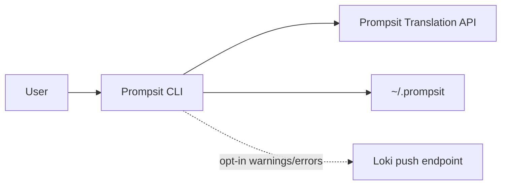
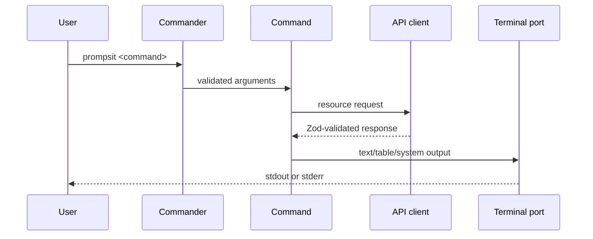

# Architecture

Prompsit CLI is a strict-TypeScript, ESM application with two presentation modes: Commander-based one-shot commands and a persistent terminal REPL. Both use the same command implementations and terminal output port.

## System context

```mermaid
flowchart LR
  User --> CLI[Prompsit CLI]
  CLI --> API[Prompsit Translation API]
  CLI --> Data[~/.prompsit]
  CLI -. opt-in warnings/errors .-> Loki[Loki push endpoint]
```

The default API stand is `https://edge.prompsit.com`; loopback HTTP is allowed for local development. The CLI owns local configuration, credentials, caches, command history, debug logs, and downloaded result files. The backend owns API behavior and job result URLs.

## Modules

| Area | Responsibility |
|---|---|
| `src/index.ts`, `src/program.ts` | Startup, logging, command composition, CLI/REPL selection |
| `src/commands/` | User workflows, validation orchestration, API-to-view mapping |
| `src/api/` | HTTP transport, auth session, resources, SSE, response validation |
| `src/config/` | Zod defaults, environment overrides, TOML and credential persistence |
| `src/output/` | CLI/REPL-neutral terminal port and table models |
| `src/repl/`, `src/tui/` | Interactive input, registry, history, rendering, settings UI |
| `src/i18n/` | UI translation catalog and cache |
| `src/logging/` | Pino diagnostics, local file, optional Loki delivery |
| `src/runtime/` | Platform, filesystem, cancellation, and process-level utilities |
| `src/errors/`, `src/shared/` | Error contracts and cross-cutting constants |

The enforceable dependency rules live in [`.dependency-cruiser.cjs`](../../.dependency-cruiser.cjs). In particular, API/config/runtime/error modules may not depend on presentation modules, output models may not consume API DTOs directly, and circular imports are forbidden.

## Runtime flows

### One-shot command

```mermaid
sequenceDiagram
  participant U as User
  participant P as Commander
  participant C as Command
  participant A as API client
  participant T as Terminal port
  U->>P: prompsit <command>
  P->>C: validated arguments
  C->>A: resource request
  A-->>C: Zod-validated response
  C->>T: text/table/system output
  T-->>U: stdout or stderr
```

### REPL command

The REPL registry is the metadata source for completion, help, examples, and dispatch mapping. `ReplService` rejects sensitive commands from persistent history, echoes ordinary commands as structured events, and dispatches through the same Commander program. The REPL terminal adapter converts output into events consumed by the history renderer.

### Long-running file job

Document translation, file evaluation, scoring, annotation, and TM import submit work to the API. The client tracks the job through SSE or polling according to configuration, handles cancellation, then downloads the server-provided result URL through a unique temporary file before replacing the destination.

### Authentication

Device login starts at `/v1/auth/device` and polls `/v1/auth/device/token`. Issued account secrets use `/v1/auth/token`. `AuthSession` adds bearer tokens and performs one synchronized refresh/retry when required. Credential writes are atomic and guarded by a cross-process lock.

## Persistent state

The data directory defaults to `~/.prompsit` and can be overridden by `PROMPSIT_DATA_DIR` for isolated automation.

| Path | Owner |
|---|---|
| `config.toml` | Settings |
| `credentials.json` | OAuth tokens and account metadata |
| `history` | Non-sensitive REPL commands |
| `translations/` | Cached UI translations |
| `examples/` | Installed examples |
| `debug.log` and rotated backups | Diagnostics |

## Stable decisions

- [ADR-001](../reference/adrs/adr-001-cli-framework.md): Commander.js command model.
- [ADR-002](../reference/adrs/adr-002-http-client.md): got transport.
- [ADR-003](../reference/adrs/adr-003-configuration.md): Zod plus TOML configuration.
- [ADR-004](../reference/adrs/adr-004-repl-input-handling.md): pi-tui REPL.

Update this document when module ownership, enforced dependency rules, persistent state, or a cross-component runtime flow changes.
